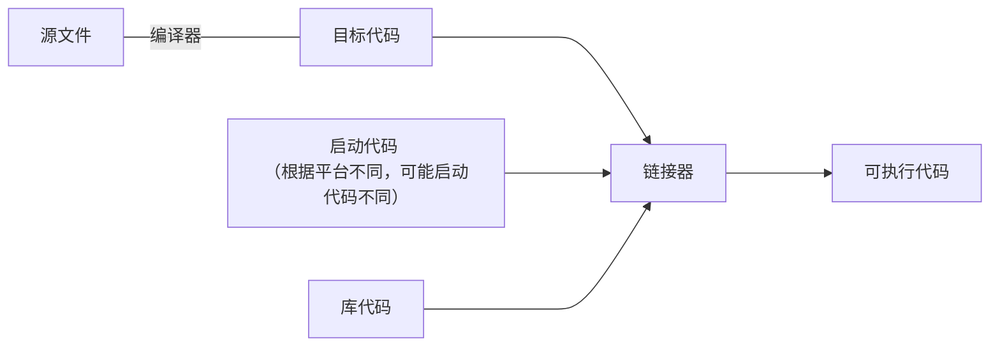

### c语言编程的七个步骤

1. 定义程序目标

2. 设计程序

3. 编写代码

4. 编译

5. 运行程序

6. 测试和调试程序

7. 维护和修改程序

   

### 源文件到可执行程序的过程




#### 目标代码和可执行代码关系:

1. 目标代码和可执行代码都由机器语言指令组成的；
2. 目标文件中只包含编译器为你编写的代码翻译的机器语言代码；
3. 可执行文件中还包含编写的程序中使用的库函数和启动代码的机器代码；


### 初始代码片段讲解

```c
#include<stdio.h> // 预处理指令（preprocessor directive）头文件，本质是粘贴复制 stdio.h 到此处

int main(void) { // 声明了一个函数，int表示函数的返回值类型，void表示main函数参数是空的
	/* 
    	多行注释
  */  
  // 单行注释
  int dogs; // 声明了一个变量，该变量是int类型，dogs是标识符（identifier）
  
  printf("Hello word"); // 打印
  return 0; // 返回值
}
```

### 命名

1. 可以用小写字母、大写字母、数字和下划线（_）来命名。而且，名称 的第1个字符必须是字符或下划线，不能是数字。

2. 不能使用 $ 等开头;
3. 区分大小写；


### 浅析为什么scanf需要&

在`printf`中可以直接打印出变量名，不需要加上指针，是因为只是读取，不是修改

在`scanf`中则需要把用户输入的值直接赋值给变量，所以修改所以使用指针直接找到变量地址


### 位，字节和字

+ 最小的存储单位是位(bit),可以储存0或1;
+ 最常用的存储单位是字节(byte)，对于几乎所有的机器，1字节均为8位（1byte = 8bit），那么1字节就有2的8次方（256）的0和1组合；
+ 计算机给的自然单位是字(word)，如果计算机是32位（字长-word size），那么就是 1 word = 32bits;
  + 如果计算机的字长越大，其数据转移越快，允许的内存访问也更多。


### printf打印不同进制的值

+ 十进制 (&d), d --- decimal
+ 八进制 (%o), o --- octal
+ 十六进制(%x), x --- hexadecimal


